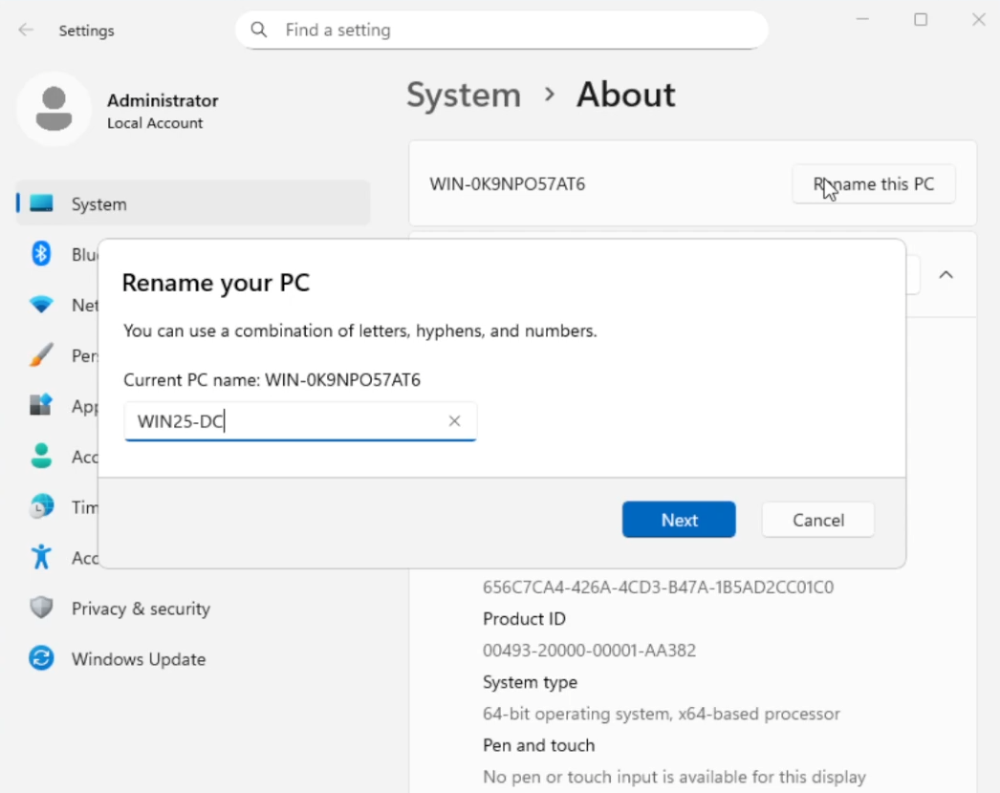
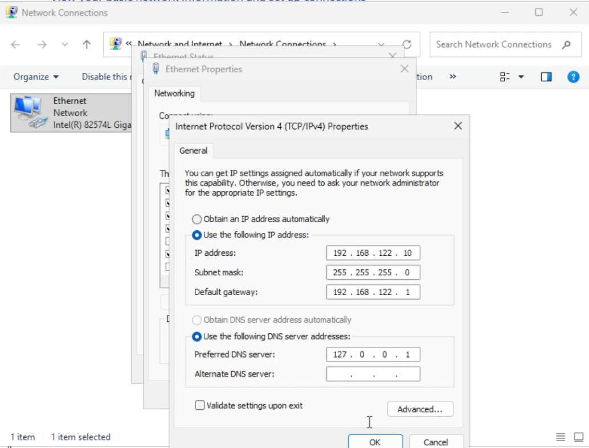
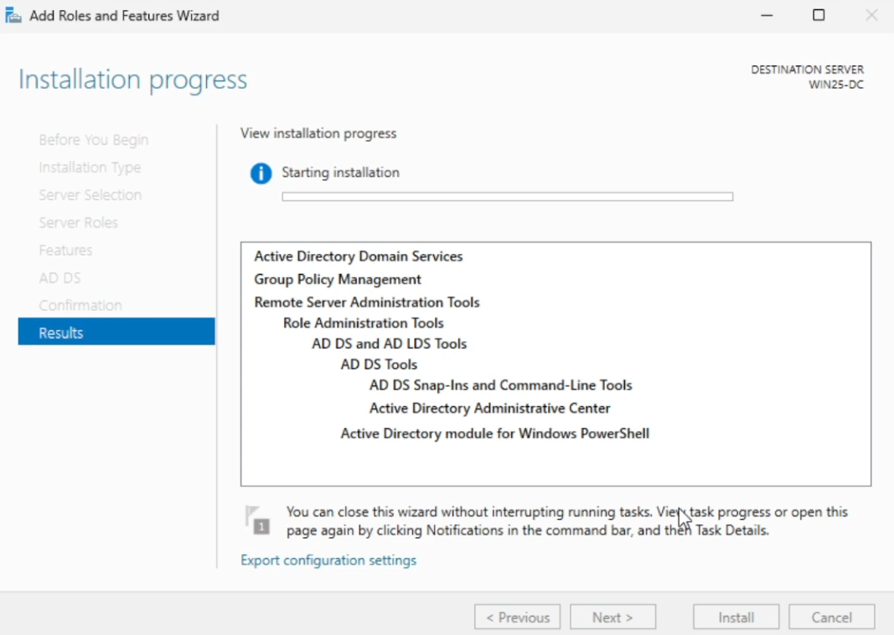
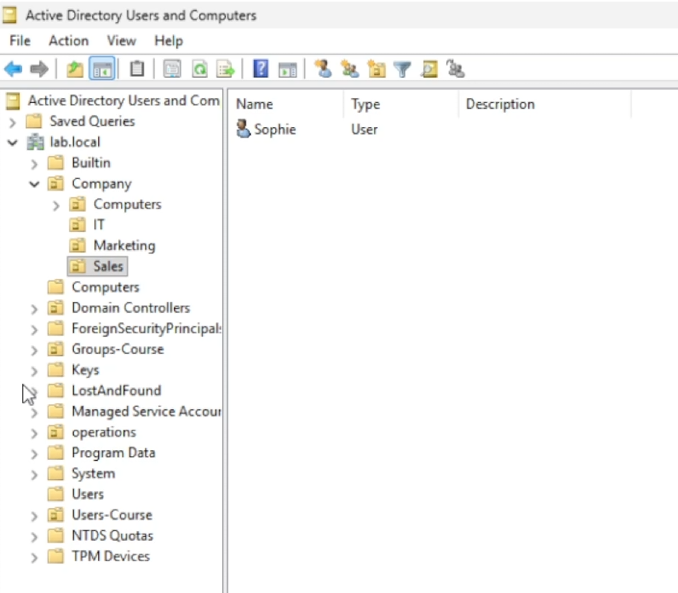
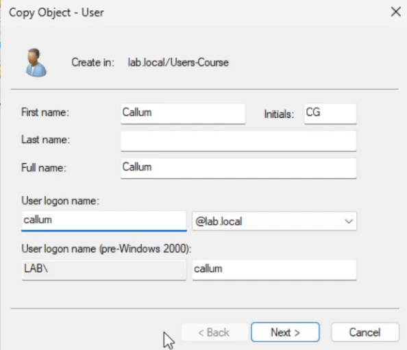
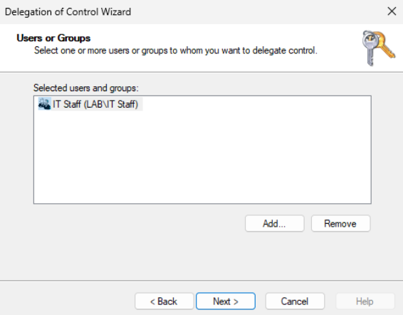
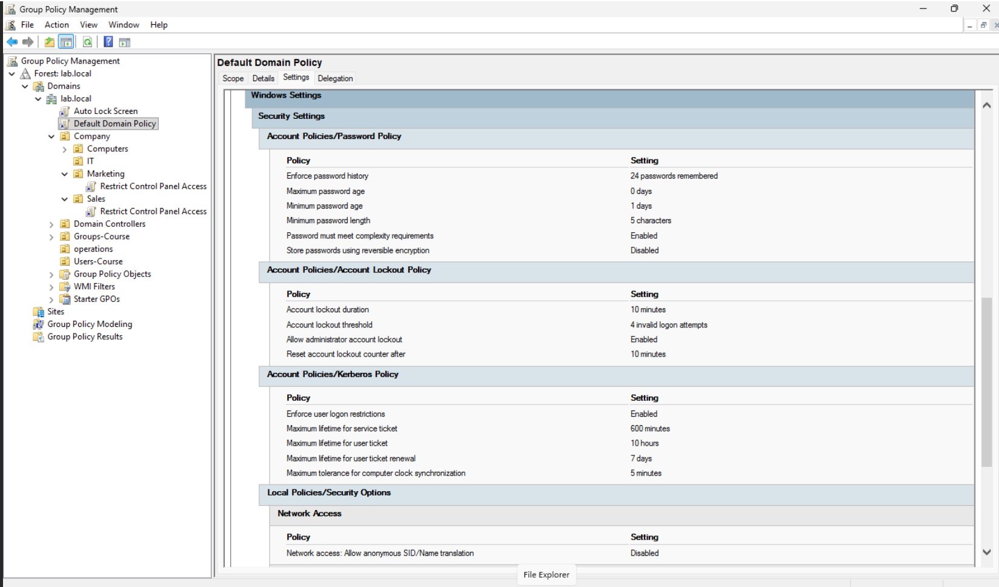
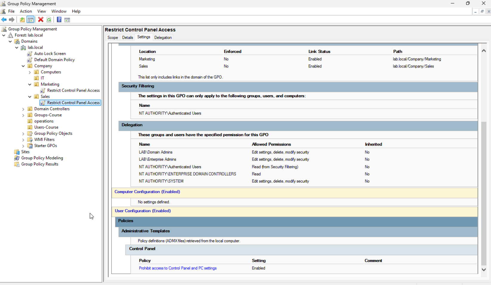
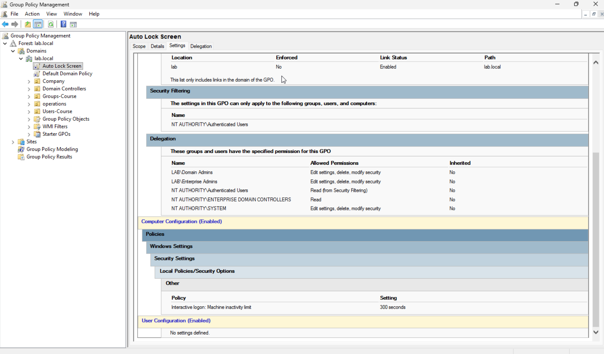

# Active Directory Home Lab

Welcome to my Active Directory (AD) home lab, I have designed this to simulate a small enterprise network using windows server 2025 and windows 11 pro This lab provides hands on experience with deploying and managing AD, DNS, Group and Security policies in a virtual environment using Cockpit.

---

## Tools & Technologies

- **Hypervisor:** KVM/QEMU managed via Cockpit on Ubuntu Server
- **Domain Controller:** Windows Server 2025
- **Client Machines:** Windows 11 Pro
- **Management Tools:** PowerShell, Command Prompt, Active Directory Users & Computers, Group Policy Management Console

---

## Key Objectives

- Building and maintain an Active Directory environment.
- Set up DNS and DHCP services to support the environment.
- Create and manage user accounts, security groups, and delegation of control.
- Configure and apply Group Policy Objects (GPO's) to enforce security standards.
- Join Windows 11 Pro client machines to the domain and validate policy application.

---

## Environment Setup

All the devices run on a self-hosted HP Elite Desk Ubuntu Server. The KVM Hypervisor is managed through Cockpit's web interface. The VMs communicate over libvirt's default NAT network (192.168.122.0/24) to provide isolation from the home network while still having access to the internet.

| Virtual Machine          | Specs & Role                                         |
| ------------------------ | ---------------------------------------------------- |
| win25-dc                 | 6GB RAM \| 60GB Storage \| Static IP: 192.168.122.10 |
| client1 (Windows 11 Pro) | 4GB RAM \| 40GB Storage \| DHCP from DC              |

### VM Creation

Each VM was created using `virt-install` on the Ubuntu command line, with ISOs sourced from the [Microsoft Evaluation Centre](https://www.microsoft.com/en-us/evalcenter/). A key challenge during the setup was loading the VirtIO storage devices during the windows installation. These were attached as a secondary CD drive and the `vistor` driver was loaded manually through the windows installer's load driver option.

---

## Server Configuration

After installing Windows Server 2025, the following steps were completed before promoting the server to a Domain Controller.

### Step 1 - Rename the PC

Renamed the computer to `win25-dc` for a clear, identifiable hostname.

### Step 2 - Assign a Static IP

Assigned a static IP address of `192.168.122.10` with a subnet mask of `255.255.255.0`. The DNS server was set to the loopback address `127.0.0.1` in preparation for hosting DNS locally after AD promotion.

---

## Active Directory Installation

Active Directory Domain Services (AD DS) was installed via the Add Roles and Features Wizard. After role installation, the server was promoted to a Domain Controller using the Active Directory Domain Services Configuration Wizard with the domain name `lab.local`.

---

## Active Directory Deployment

### Organisational Unit Structure

A Company OU was created at the top level of the domain to contain all managed objects. Separate OUs were created for each department along with a dedicated Computers OU. This structure mirrors what you would find in a small business environment and is necessary for applying Group Policies at a departmental level.

| OU                  | Purpose                                     |
| ------------------- | ------------------------------------------- |
| Company             | Top-level container for all managed objects |
| Company > IT        | IT department user accounts                 |
| Company > Marketing | Marketing department user accounts          |
| Company > Sales     | Sales department user accounts              |
| Company > Computers | Domain-joined workstations                  |
| Groups-Course       | Security and distribution groups            |

### User Accounts

User accounts were created for each staff member across the three departments, with each following a consistent naming convention and placed in their respective departmental OUs.

| User   | Department | Login   |
| ------ | ---------- | ------- |
| Alex   | IT         | AlexS   |
| Chris  | IT         | ChrisT  |
| Ross   | IT         | RossH   |
| Mark   | Marketing  | MarkK   |
| Sophie | Sales      | SophieS |

> **Best practice followed:** The default Domain Admin account was duplicated rather than used directly for day-to-day administration. This keeps the built-in Administrator account as a break-glass fallback while the duplicated account handles routine admin tasks.

### Security Groups & Delegation

A security group was created for IT Staff to simplify permission management across the environment. Rather than assigning permissions to individual user accounts, permissions are assigned to the group — meaning any new IT staff can simply be added to the group and immediately receive the correct access.

**Delegation of Control:** The Sales OU was delegated to the IT Staff security group, allowing IT staff to create new users and manage passwords within that OU without requiring full Domain Admin rights. This follows the principle of least privilege.

---

## Group Policy Implementation

Group Policy Objects (GPOs) were created and linked to specific OUs to enforce configuration and security standards across the domain.

### Password Policy (Default Domain Policy)

- Reduced minimum password length and complexity requirements to suit a lab environment
- Adjusted maximum password age for easier testing and rotation

> **Note:** In a production environment the opposite would apply, with stricture password lengths and complexity requirements, minimum age and history enforcement. The relaxed polices here is intentional to save time while switching between user accounts for testing.

### Control Panel Access Restriction

A GPO named _Restrict Control Panel Access_ was created and linked to the Marketing and Sales OUs. This prevents non-IT staff from accessing the Control Panel and PC Settings, reducing the risk of accidental misconfiguration.

IT staff retain full access as the GPO is not linked to the IT OU.

### Auto Lock Screen (Domain-Wide)

A domain-wide GPO named _Auto Lock Screen_ was created and linked at the domain level. This configures all workstations to automatically lock after a period of inactivity.

**Note:** This is to prevent the physical risk that having an unlocked workstation in a shared office has, enforcing an automatic locking GPO ensures compliance without relying on the individual user to remember to lock their workstation.

---

## Client Configuration

_In progress to be documented upon completion._

---

## Next Steps

- Configure DHCP scope on the Domain Controller and validate client receives IP from DC
- Complete Windows 11 Pro client setup and join `client1` to the `lab.local` domain
- Log into the client with a domain user account and verify domain join
- Verify GPO application on client machines using `gpresult /r` and `gpupdate /force`
- Deploy a second Windows 11 Pro client VM (`client2`)
- Set up shared folders with NTFS and share permissions, mapped via GPO
- Practice common AD troubleshooting scenarios: account lockouts, GPO not applying, DNS resolution failures
- Create a DHCP reservation for the Domain Controller
- Explore PowerShell for AD administration (bulk user creation, password resets, group management)

---

## Challenges & Resolutions

| Challenge                                                      | Resolution                                                                                                            |
| -------------------------------------------------------------- | --------------------------------------------------------------------------------------------------------------------- |
| VirtIO disk not detected during Windows install                | Loaded `viostor` driver manually via Load Driver dialog, navigating to `viostor > w11 > amd64` on the VirtIO ISO      |
| No available PCI slots when attaching VirtIO ISO to running VM | Shut down the VM and used `virsh attach-disk` with the `--config` flag before restarting                              |
| ISOs deleted when using `--remove-all-storage` flag            | Learned to use `virsh undefine` without the flag to preserve storage; ISOs redownloaded to `/var/lib/libvirt/images/` |
| Windows 11 Home installed instead of Pro                       | Reinstalled selecting Pro edition - Home edition does not support domain joining                                      |
| Cockpit console requiring Remote Viewer for SPICE              | Recreated VM with VNC graphics which renders natively in Cockpit's browser console                                    |
